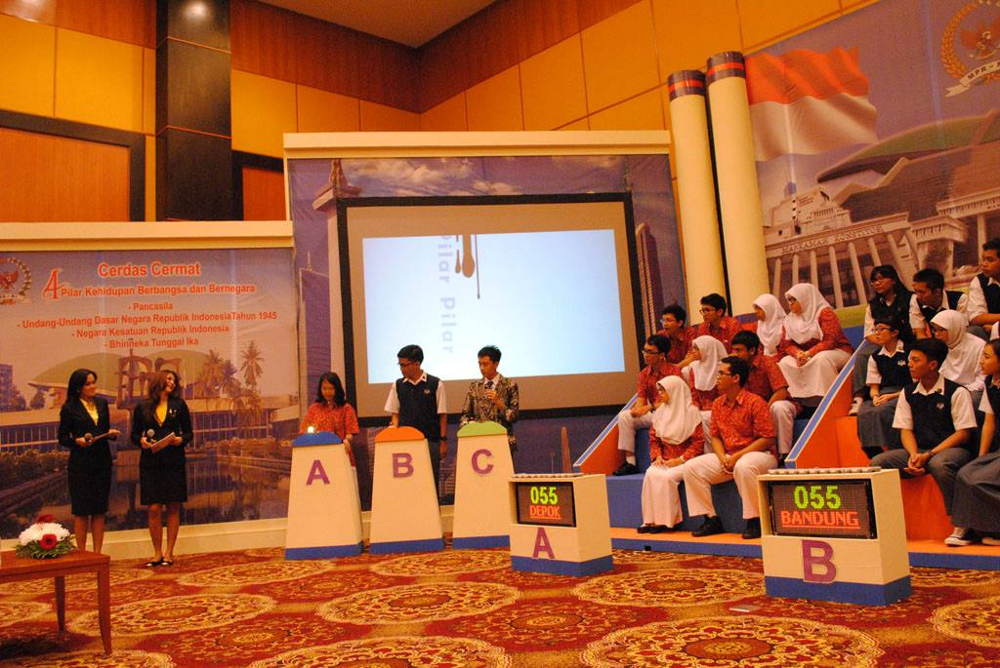
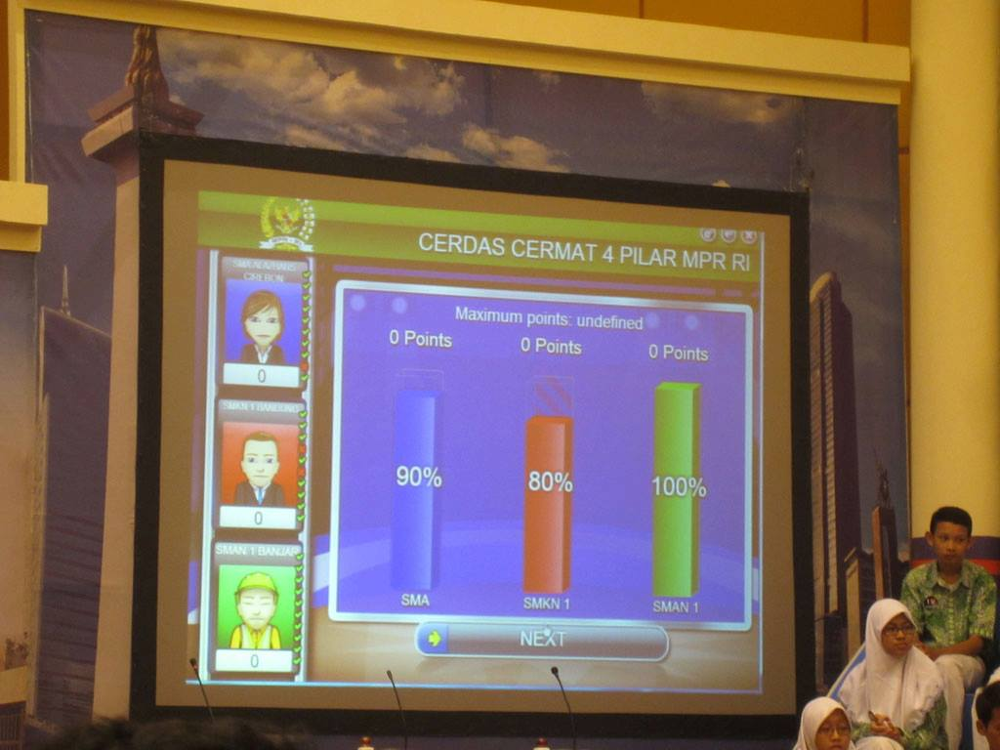

Prolognya... dua tahun terakhir (2012 dan 2013) sekolah kami ikut seleksi tingkat kota untuk Lomba Cerdas Cermat 4 Pilar Kehidupan Berbangsa dan Bernegara-nya MPR-RI (programnya pak almarhum Taufiq Kiemas). _Alhamdulillah_, dua tahun berturut-turut itu masuk ke tahap provinsi (walaupun belum berhasil tembus ke tingkat Nasional dan selalu gugur di penyisihan).

Nah, di antara dua tahun itu, ada perubahan format lomba antara tahun 2012 dengan tahun 2013 dan seterusnya. Apa sih perubahan formatnya?

<!--more-->Perubahan formatnya itu... **nggak bisa lagi diandalkan sistem juru bicara** mulai tahun 2013.

***

Kalau sebelum tahun 2013, _in the worst case_, seorang anggota tim bisa saja hanya jadi penggembira, pelengkap komposisi tim, dan posisi-posisi pasif lainnya. Kenapa? Karena sebelumnya, ada yang namanya juru bicara, yang biasanya sudah diatur sedemikian rupa sehingga punya kepiawaian berbicara. (Fenomena ini saya hanya lihat di tingkat kota sih, di tingkat provinsi umumnya sudah siap semua...)

Nah, mulai tahun 2013, sistem juru bicara ini digantikan oleh MPR. Formatnya digantikan sedemikian rupa sehingga **setiap anggota tim harus punya pemahaman yang luas tentang materi lomba**.

Yuk, kita bahas ya... saya nulis ini berdasarkan panduan LCC tahun 2013, sih. Saat ini ditulis, panduan 2014 belum keluar.

## Babak Yel-yel

... tidak ada. Babak yel-yel ditiadakan mulai tahun 2013. 😀

Sebagai gantinya, setiap tim sekarang diberikan nilai awal 50 sebelum bertanding.

## Babak Tematik/Menjelaskan

Babak ini masih relatif sama dengan tahun sebelumnya. Ada satu soal yang akan dibacakan, kemudian dalam waktu dua menit, masing-masing tim dipersilakan menjawab soal tersebut. Siapapun boleh berbicara, mau itu orang paling depan, hingga orang paling belakang. Bisa saling melengkapi, menambahkan, mengoreksi, dan lain sebagainya. Asalkan ya itu, waktunya dua menit saja.

Skor maksimal 25 poin dari satu soal.

## Babak Satu Lawan Satu

Ini yang menggantikan babak rebutan di tahun-tahun sebelumnya. Sebelumnya, saya coba gambarkan posisi panggung...

Nah, ada podium tambahan tuh, di samping posisi tim. Itu adalah podium untuk babak satu lawan satu. (Yang di tengah itu saya, btw. :D)

Teknisnya begini. Karena dalam satu tim ada sepuluh orang, nantinya ada sepuluh soal yang akan disediakan. Untuk soal pertama, setiap orang pertama dari masing-masing tim maju ke podium. Soal akan dibacakan, dan kalau peserta sudah bisa menebak/tahu pasti jawabannya apa, bel di podium bisa ditekan dan peserta bisa menjawab.

Intinya, sama-sama babak rebutan. Tapi satu lawan satu. Nggak boleh ada kerja sama dengan tim di panggung. Makanya kemampuan individu di sini menjadi penting, dan nggak bisa lagi ada yang namanya hanya sekadar 'pelengkap' tim.

Skor jika jawaban benar adalah 10, jika jawaban salah adalah -5. Jika jawaban salah, soal akan dibacakan sekali lagi untuk dua peserta lainnya yang mungkin mau menjawab. Begitu seterusnya untuk sembilan orang dan sembilan soal sisanya. 🙂

## Babak Pilihan Benar Salah

Sebelum tahun 2013, kalau tidak salah adegan-adegan seperti ini masih ditemukan...

Pembawa acara membacakan soal. Kemudian dalam sebuah gerakan, semua anggota tim mendekat, dan kemudian juru bicara akan mengatakan, "Benar!" atau "Salah!" Setelah semua antusiasme itu, kemudian juri mengatakan, "Jawaban benar, skor 10." Dan sorak-sorai sejenak.

... atau juri mengatakan "Jawaban salah, skor 0." Dan sesama teman akan saling menguatkan, "nggak apa-apa, nggak apa-apa, ayo, ayo!"

Suasana sosial yang indah :') #apaini

Nah, mulai tahun 2013 ini semua percakapan itu sekarang mayoritas digantikan oleh layar besar ini:

Jadi, masing-masing peserta nantinya akan memegang _voting pad_ seperti acara Mario Teguh kalau sudah masuk sesi jajak pendapat. Di _voting pad_ itu nanti ada tiga tombol: tombol "Benar", tombol "Salah", dan tombol _transmit_.

Teknisnya, seperti biasa, ada sepuluh soal yang disediakan. Setelah pembawa acara membacakan soal, masing-masing peserta harus menekan tombol "Benar" atau "Salah" di _voting pad_ mereka, sesuai dengan pemikiran masing-masing, apakah pernyataan yang barusan dibacakan itu benar atau salah. Tidak boleh kerja sama lagi 🙂

Secara _live_, ketika peserta menekan tombol _voting pad_ mereka, di layar akan muncul indikator, apakah orang ke-sekian sudah menjawab atau belum. Nanti juri akan menyebutkan jawaban yang benar apa, kemudian di layar akan muncul skor masing-masing tim apa...

... lengkap dengan siapa saja peserta yang menjawab salah. XD

Akhirnya, penghiburan yang diberikan teman-teman satu tim akan secara jelas mengarah kepada oknum-oknum yang menjawab salah itu. 😀

***

Nah, kurang lebih seperti itu gambaran format baru LCC 4 Pilar Kehidupan Berbangsa dan Bernegara. Mudah-mudahan membantu bagi teman-teman yang akan bertanding di kegiatan ini tahun 2014, 2015... dan seterusnya. 🙂
