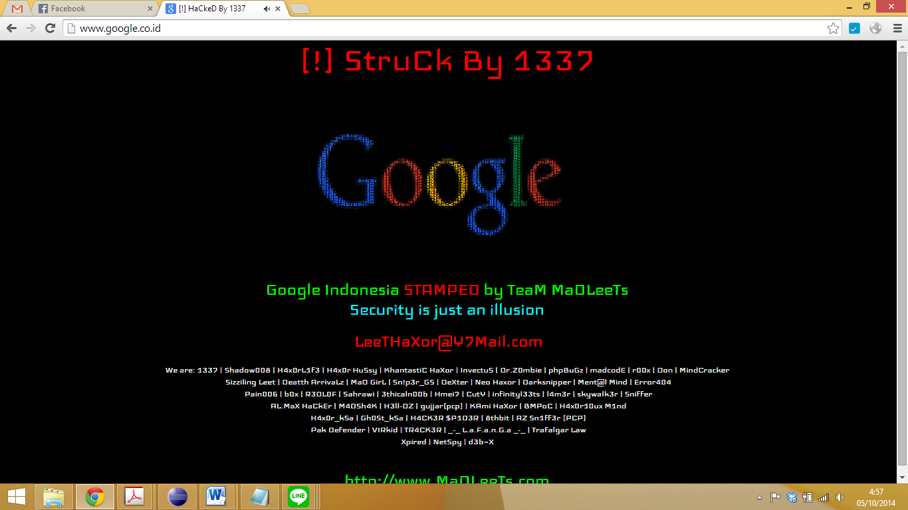

Sambil menunggu keluarga di rumah bersiap untuk berangkat shalat Idul Adha, saya membuka laptop untuk _browsing_, sekadar mampir di Facebook, Twitter, Quora, dan beberapa media sosial lainnya. Entah apa yang saya kerjakan hingga kemudian saya membuka tab baru dan mencoba mengakses Google Indonesia.

Dan, tampilan di atas yang saya temui.

_Wait, what?_ Sekelas Google Indonesia pun kena retas juga?

<!--more-->Entahlah. 

_Feeling_ saya mengatakan bahwa tidak wajar perusahaan sekelas Google kena retas. _Something just went off..._ hingga saya menemukan bahwa situs Google di www.google.com masih bisa diakses.

Dengan data seminim itu saya mencoba berdeduksi. Bukan Google-nya yang diretas. Mungkin DNS-nya yang diretas.

Karena sudah mau berangkat ke tempat shalat, jadi saya matikan saja dulu laptop saya. Untuk membuktikan hipotesa tadi, saya coba lakukan dua hal dengan ponsel saya selama masih di rumah:

  1. _Connect_ ke Wi-Fi di rumah (yang menggunakan Telkom Speedy). Coba akses www.google.co.id. Hasil: tampilan Google Indonesia yang sudah berubah jadi warna hitam itu muncul di ponsel saya.
  2. _Disconnect_ dari Wi-Fi di rumah dan coba gunakan koneksi _mobile data_. Saya sempat pesimis karena saya menggunakan Telkomsel dan dugaan saya server DNS yang digunakan pasti sama. Ternyata ... _voila!_ Google Indonesia tidak apa-apa. Baik-baik saja 🙂

Perusahaan sebesar Google rasa-rasanya tidak akan tumbang dengan serangan _deface_ seperti ini. Entah kenapa rasa-rasanya tidak mungkin. Kalaupun iya, tampilan hasil _deface_-nya semestinya lebih keren sedikit. (Entahlah, demikian _feeling_ saya berbicara.)

Sepulang dari shalat Idul Adha saya mencoba akses lagi. Yang saya alami, sekarang selalu muncul galat _connection timed out_ dari Google Chrome saya. Sementara itu, saya coba lakukan _quick search_ di Twitter dan menemukan bahwa tampilan-nya sekarang lebih semarak: di bawah pesan peretas itu malah ada tombol Facebook Like segala. :))

Akhirnya, saya coba laporkan ke @TelkomCare.





_Long story short_, setelah bertukar informasi di _direct messages_ dan beberapa _mention_, akhirnya dibuatlah pengaduan.



Saya cukup senang bahwa _customer service_ @TelkomCare ini cukup responsif. Bahkan, di _direct messages_ pun laporan saya ditanggapi oleh tiga orang sekaligus, padahal ini hari libur 🙂 Setahu saya, bahkan ketika ayah saya melapor ke Telkom 147 pun nomor pelaporan semacam itu tidak diinformasikan.

Jadi? Kesimpulannya apa? Google Indonesia tidak diretas. Tidak semudah itu meretas situs Google Indonesia. Yang diretas — mungkin — DNS server yang dipakai Telkom Speedy. Tapi saya penasaran apakah memang semudah itu meretas DNS server? Kalau benar, apakah berarti keamanan kita lemah? Entahlah. Ilmu saya belum sampai ke sana. Saya masih menikmati perjalanan awal di _software engineering_ 😀

(Dan, belakangan, setelah saya coba atur manual DNS server di _router_ saya ke Google Public DNS di 8.8.8.8 dan 8.8.4.4, saya bisa mengakses kembali situs Google Indonesia dengan lancar.)
