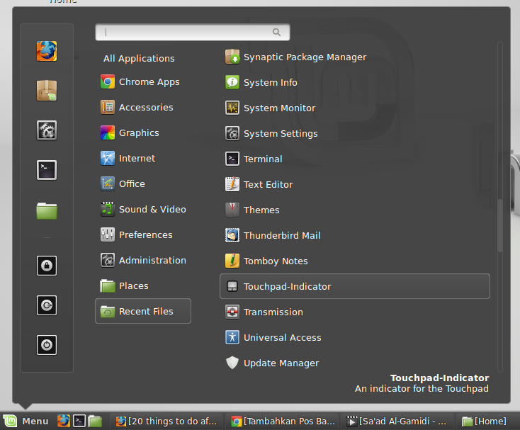
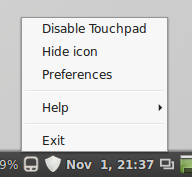
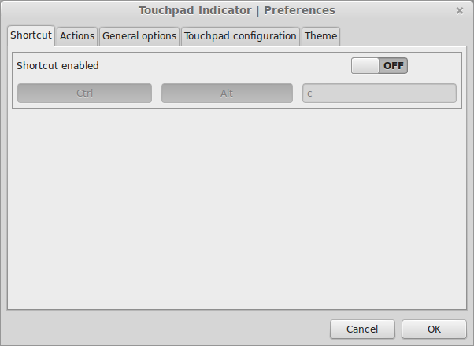
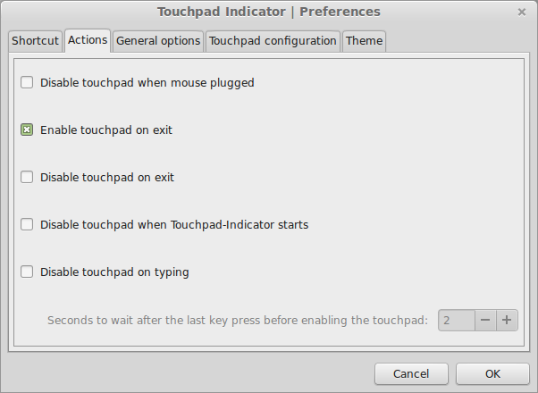
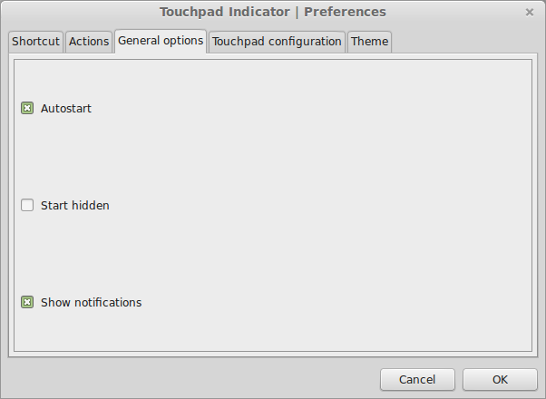
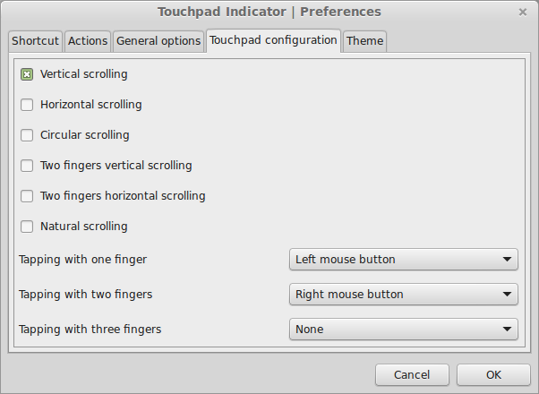
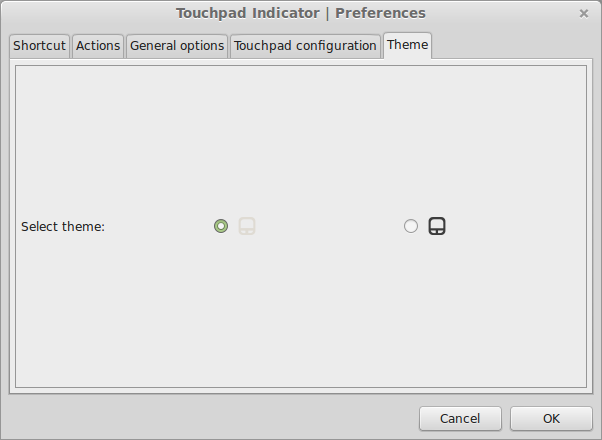

Saya menggunakan Linux Mint 17 Qiana di laptop saya (yang berbasis Ubuntu 14.04 LTS). Penggunaan saya sehari-hari dengan laptop ini lebih dominan menggunakan _mouse_ eksternal dibandingkan dengan _touchpad_ dan _trackpad_-nya (saya pakai Lenovo ThinkPad E440). Sehingga, akan nyaman bagi saya untuk dapat mematikan _touchpad_-nya ketika saya menggunakan _mouse_ eksternal — apalagi di _keyboard_ laptop ini tidak ada _switch_ untuk mematikan _touchpad_-nya.

Untuk keperluan ini, saya menggunakan **touchpad-indicator**:

```
sudo add-apt-repository ppa:atareao/atareao
sudo apt-get update
sudo apt-get install touchpad-indicator```

Selanjutnya, aplikasi ini di-_launch_ untuk pertama kalinya dari _launcher_.

<!--more-->



Setelah dijalankan dari _launcher_, maka aplikasi ini akan berjalan di _system tray_.


Dan seperti aplikasi yang berjalan di _system tray_ pada umumnya, semua menu dapat dibuka dengan cara klik kanan pada icon aplikasi tersebut. (**touchpad-indicator** dilambangkan dengan simbol _touchpad_.)



Berikut ini adalah daftar opsi yang disediakan oleh **touchpad-indicator**.










