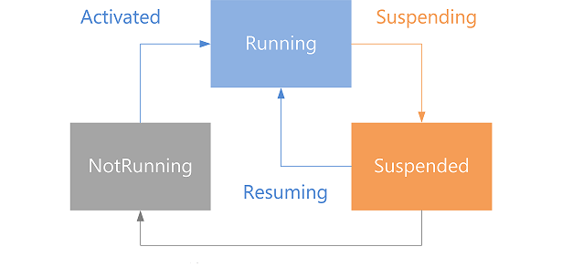

Dalam merancang sebuah Windows App, kita perlu tahu bagaimana sebuah aplikasi "menjalani kehidupannya", karena skema hidup Windows App sedikit berbeda dengan aplikasi desktop pada umumnya. Dengan memperhatikan lifecycle sebuah aplikasi, kita bisa menghadirkan user experience yang nyaman bagi pengguna App kita.

Secara umum, lifecycle (daur hidup) sebuah Windows App bisa digambarkan dengan state-diagram berikut [1]:

<!--more-->

### Peluncuran App

Sebuah App diluncurkan ketika:

  * diaktifkan oleh user melalui Start menu, dan
  * sebelumnya ada pada state **NotRunning**. Sebuah App bisa berada pada state ini karena memang belum diluncurkan, pernah berjalan namun crash, atau di-suspend tapi kemudian di-close oleh sistem karena tidak dapat ditampung lagi di memori.

Ketika sebuah App diluncurkan, maka App akan menampilkan splash screen. Developer harus memastikan bahwa semua proses yang dibutuhkan untuk menyiapkan aplikasi dapat berjalan saat splash screen ini muncul. Proses-proses ini harus berjalan dengan cepat. Jika ada proses yang tidak dapat dijamin cepat, seperti me-load data dari Internet, maka proses ini harus berjalan setelah splash screen selesai tampil.

Setelah tahap peluncuran selesai, maka App akan berada pada state **Running**.

### Aktivasi App

Selain dengan cara biasa (diaktivasi melalui Start menu), ada banyak cara aktivasi sebuah aplikasi. Misalnya, aplikasi kita di-register untuk menangani event yang berkaitan dengan kamera. Maka ketika user membutuhkan kameranya untuk bekerja, Windows akan memanggil aplikasi kita.

Kita dapat mendeteksi berbagai cara aktivasi ini pada program kita dengan menangani method [OnActivated][1] (pada XAML, atau [WinJS Activated][2] pada HTML).

Pada tahapan aktivasi ini juga, kita dapat me-restore data yang disimpan pada saat App di-suspend.

### Suspensi App

Ketika user pindah dari App kita ke App lain (atau ke tampilan lain), maka App kita akan di-suspend. Jika user pindah ke background, maka Windows akan menunggu beberapa detik. Jika dalam jangka waktu ini user tidak kembali ke App kita, maka App kita akan di-suspend. App juga akan di-suspend jika device dalam keadaan low battery.

Dalam jangka waktu 5 detik setelah App kita di-suspend (pada Windows; 1-10 detik pada Windows Phone), jika user tidak kembali, maka App akan di-terminate.

Sebelum App di-suspend, maka event [Application.Suspending][3] (pada XAML, atau [WinJS checkpoint][4] untuk HTML) akan di-raise. Method yang melakukan listening pada event ini akan dipanggil. Pada method inilah kita memiliki kesempatan terakhir untuk menyimpan data, karena saat App di-terminate, tidak ada event apapun yang di-raise.

### Resume

Jika device keluar dari keadaan low battery atau user kembali ke App kita, maka App akan keluar dari state **Suspended** dan kembali ke state **Running**.

### Crash

Ketika ada crash, maka user akan kembali ke Start menu. Jika user mengaktifkan kembali App kita, maka App akan diaktifkan dari state **NotRunning**. Dalam kondisi ini, kita tidak boleh mengandalkan data yang (biasanya) disimpan pada saat state **Suspended** karena kemungkinan besar data tersebut corrupt akibat crash.

### Referensi

\[1\] ["App lifecycle". Microsoft Windows Dev Center.][5]

 [1]: https://msdn.microsoft.com/en-us/library/windows/apps/windows.ui.xaml.application.onactivated.aspx
 [2]: https://msdn.microsoft.com/en-us/library/windows/apps/br212679.aspx
 [3]: https://msdn.microsoft.com/en-us/library/windows/apps/windows.ui.xaml.application.suspending.aspx
 [4]: https://msdn.microsoft.com/en-us/library/windows/apps/br229839.aspx
 [5]: https://msdn.microsoft.com/en-us/library/windows/apps/hh464925.aspx
