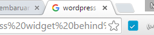
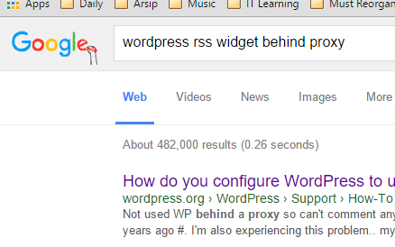

Pagi ini, saya ingin menambah beberapa fitur di website JTK. Karena widget RSS tidak berfungsi (karena servernya harus melalui proxy supaya bisa tersambung ke Internet—ada yang bisa bantu?), saya kemudian mencari solusinya di Google.

Sebenarnya mulanya biasa saja. Hingga kemudian ketika akan meng-close tab-tab yang ada, saya heran,

"Logo website apa itu?" tanya saya dalam hati.

Begitu saya buka tab-nya, "lho, Google?"

<!--more-->

Saya kira logo di samping search box itu hanya Google Doodle biasa. (Google Doodle, logo-logo yang biasanya ditampilkan Google kalau ada perayaan khusus.) Kemudian, saya klik logo kecil itu, yang kemudian membawa saya ke halaman depan Google.

Dan, terlihatlah animasi perubahan logo Google lama ke logo baru.



Ketika logo tersebut diklik, kita dapat melihat sejarah dari logo Google dari paling awal hingga saat ini. Kita juga dapat melihat [press release][1] dari peluncuran logo Google baru kali ini.

Saya pribadi menyukai logo Google yang baru ini. Saya melihat kesan dinamis, semangat muda, dan teknologi tinggi dari animasi-animasinya.

**Bagaimana logo Google baru menurutmu?**

 [1]: http://googleblog.blogspot.com/2015/09/google-update.html
