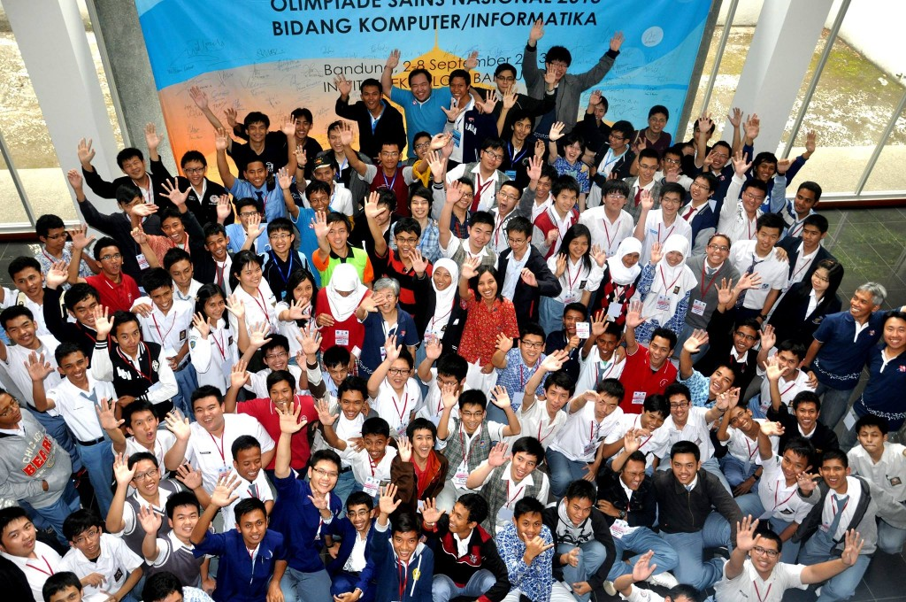



> **With great power, comes great responsibility.**

Setahun lalu, bertanding adik-adik saya di Mataram, Nusa Tenggara Barat, di OSN 2014. Ada video menarik yang diputar ketika pembukaan OSN di sana; ada dokumenter dua orang alumni OSN dan IOI, yaitu Handayani, salah satu siswa inklusi yang meraih medali perak OSN PKLK 2013 (dan saya bangga pernah bertemu beliau ketika penutupan OSN 2013 lalu), dan Derianto Kusuma, peraih medali emas OSN 2003, co-founder [Traveloka.com][1].

Video tersebut (di atas) [saya share di timeline saya di Facebook][2] tanggal 3 September 2014, persis setahun lalu, ketika saya menjadi mahasiswa baru Politeknik Negeri Bandung. Video ini memberi saya motivasi yang cukup besar saat itu, menyadarkan saya kuat-kuat bahwa saya adalah alumni OSN 2013, dan saya berhasil menyisihkan sekian ribu peserta dari level OSK hingga OSP.

Masalahnya bukan saya berhasil menyisihkan mereka; masalahnya bukan saya adalah alumni OSN 2013. Tetapi, masalahnya adalah pertanyaan yang diberikan Derianto di menjelang akhir video,

> **Kalian perlu bertanya pada hari ini, apakah pantas kalian di sini?**

<!--more-->Saat itu, saya sedang dalam kondisi down karena saya pada akhirnya memutuskan untuk berkuliah di Politeknik Negeri Bandung setelah diterima di Institut Pertanian Bogor — tempat yang mulanya saya incar dan perjuangkan dengan berbagai jalur penerimaan, selain Institut Teknologi Bandung.

Pertanyaan Derianto 'menampar' saya cukup keras karena saat itu saya merasa 'pantas' berada di IPB dengan status saya sebagai alumni OSN 2013. Kalau dibandingkan dengan alumni dan medalis lainnya, saya hanyalah "butiran debu". Tidak seberapa persennya.

Terutama karena mulanya, pernah terlintas pemikiran bahwa hadir di OSN 2013 tahun kemarin itu sekadar titik pengalaman besar saja bagi saya — dan karena saya memang belum berhasil meraih medali di sana.

Saat itu, saya kemudian berniat: posisi saya di Polban ini tetap harus menjadi pembuktian bahwa memang saya pantas berada di OSN 2013 saat itu.

***

Hari ini, saya diingatkan oleh fitur [On This Day][3]-nya Facebook akan share tersebut.

Saya memutuskan menonton video-nya kembali.

_Dan saya tertampar kembali untuk kedua kalinya._

Karena saya merasa belum berkontribusi apa-apa sesuai kemampuan saya. _Maybe I performed well but I think I didn't contribute well._ Boleh saja IPK saya cukup tinggi, tetapi saya merasa IPK tersebut hanya untuk diri saya sendiri. Dalam hal kontribusi ke lingkungan sekitar, saya merasa rendah.

Bahkan mungkin delta performa saya dari awal masuk Polban hingga saat ini tidak terlalu banyak. Di saat yang sama, ada teman-teman saya seperti [Imam Fauzan][4] yang dengan ilmunya yang ia peroleh di SMA, karyanya justru lebih usable dibanding karya saya, dan dengan ilmu-ilmu baru yang diperoleh di Polban, karyanya justru lebih berkembang. Atau [Fadhlan Ridhwanallah][5] yang baru setahun mengenal informatika namun karyanya bisa dipakai di klinik ibunya.

Malam ini, saya kembali merenungi kata-kata Derianto,

> Apa makna dari pengalaman OSN ini buat kalian?
>
> Mungkin, saya bakal bilang quote yang tadi, "with great power comes great responsibility". Itu kayaknya dari Star Wars kalau saya nggak salah.
>
> Tapi intinya sebenarnya simpel.
>
> Mungkin OSN ini cuma jadi satu titik pengalaman saja di hidup kalian, tapi sebenarnya ini adalah pertanda bahwa kalian adalah salah satu dari generasi terpilih. Jadi kalau kalian ke depannya tidak memanfaatkan dan tidak berkontribusi sesuai dengan apa yang sebenarnya kalian mampu, sesuai dengan kapasitas kalian,
>
> **Kalian perlu bertanya pada hari ini: Apakah pantas kalian di sini?**
>
> Kalau kalian jawab iya, kalian adalah seorang yang spesial.
>
> <cite>Derianto Kusuma</cite>

***

Video itu ditutup dengan sebuah quote,

> Apapun yang diperbuat oleh seseorang itu, hendaknya dapat **bermanfaat bagi dirinya sendiri, bermanfaat bagi bangsanya, dan bermanfaat bagi manusia di dunia pada umumnya**.

> <cite>Ki Hajar Dewantara</cite>

***

_Akankah ... saya kembali tertampar untuk ketiga kalinya di 3 September 2016 ...?_

_Saya harap tidak ..._

 [1]: http://www.traveloka.com
 [2]: https://www.facebook.com/saifulwebid/posts/10201646632088087
 [3]: https://www.facebook.com/onthisday/
 [4]: https://www.facebook.com/imamfzn
 [5]: https://www.facebook.com/fadhlan.ridhwanallah
