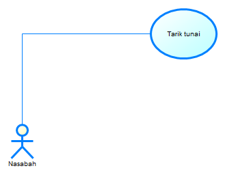
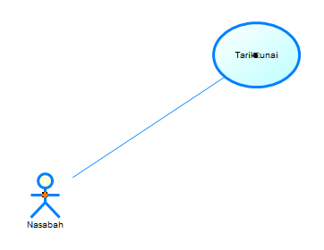
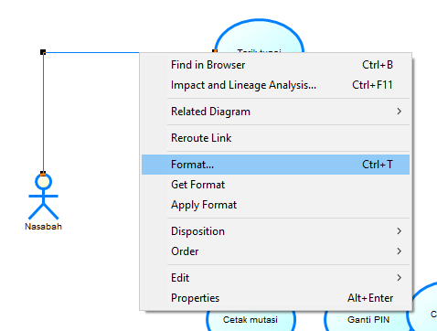
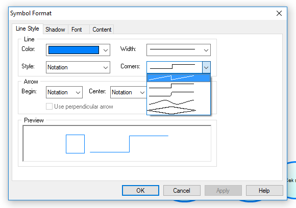
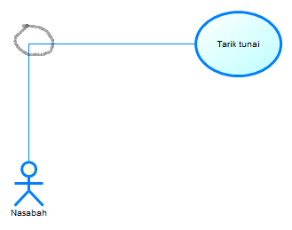
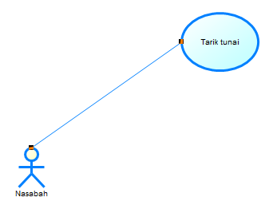

Di semester 4 ini salah satu mata kuliah yang saya pelajari adalah Analisis dan Perancangan Perangkat Lunak 1 (APPL-1). Pada mata kuliah ini, kami menggunakan _software_ PowerDesigner untuk membuat _use case diagram_ dan kawan-kawannya.

Salah satu masalah yang muncul adalah ketika membuat asosiasi dari _actor_ ke _use case_, garis yang muncul tidak bisa lurus. Bentuknya garis patah-patah, seperti ini:

Padahal, notasi yang umum digunakan, garis asosiasi dari _actor_ ke _use case_ itu wujudnya berupa garis lurus.

<!--more-->Bukan hanya satu-dua orang yang mencoba, tapi kami sekelas mencoba meluruskan garis bengkok ini sulitnya minta ampun. (Lain halnya kalau "membengkokkan garis lurus" yang kami pelajari di mata kuliah Aljabar Linear. Lebih mudah itu.)

Ternyata, setelah mencari-cari di _search engine_ agak dalam, ketemulah _[thread ini][1]_. Di sana ada _statement_ seperti ini:

> What line mode have you selected? There are a number of different modes. [...] First is the jagged line (lightening bolt). This mode is all straight lines with elbows. **No attempt is made to keep the lines horizontal or vertical.**

Membaca _statement_ itu saya mendapat _feeling_ bahwa ini adalah jawaban yang saya (dan kawan-kawan) cari. Setelah mencoba beberapa kali, akhirnya garis bengkok itu berhasil diluruskan.

Caranya ternyata mudah: **gunakan mode Corners "jagged line/lightning bolt" pada format asosiasi yang dibentuk**.

Lengkapnya seperti ini:

Pertama, klik kanan pada garis asosiasi. Pilih menu Format.

Pada _window_ "Symbol Format" yang muncul, pada _tab_ "Line Style", pilih opsi pertama (bergambar _jagged line_ atau seperti garis kilat) pada pilihan "Corners".

Selanjutnya, tekan tombol Ctrl di _keyboard_, lalu klik kiri pada sudut yang ingin dihilangkan.

Voila!

Garis yang bengkok sudah bisa diluruskan. Dengan cara yang sama, kita bisa "membengkokkan" garis lurus dengan menambah sudut-sudut lain pada garis yang ada.

Semoga bermanfaat. (Khususnya untuk saya sendiri — hal-hal begini, kalau tidak dicatat di suatu tempat, pasti akan mudah terlupakan.)

 [1]: http://codeverge.com/sybase.powerdesigner.general/lines-with-angles/832901
